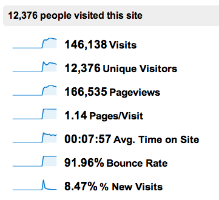
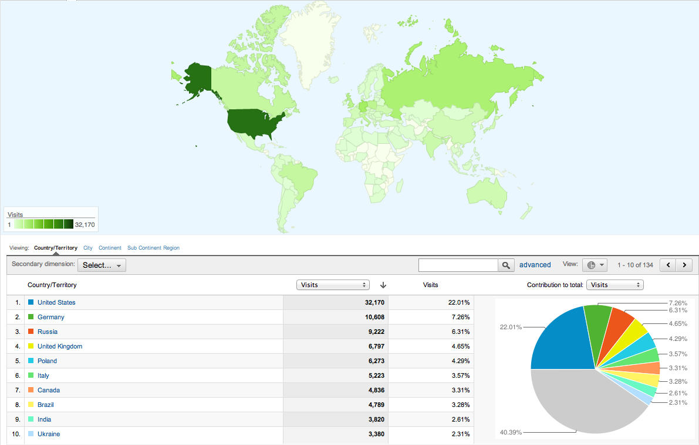
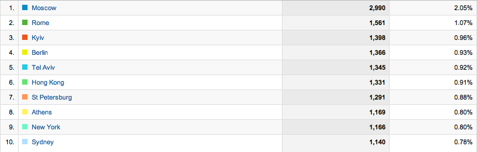
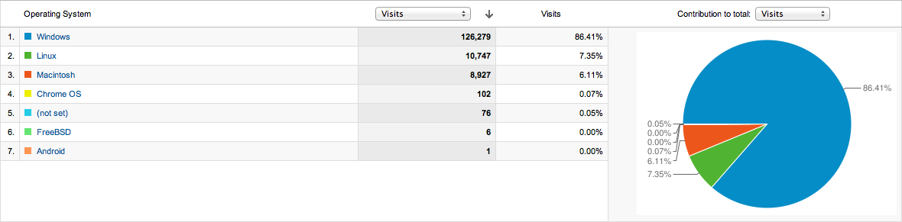
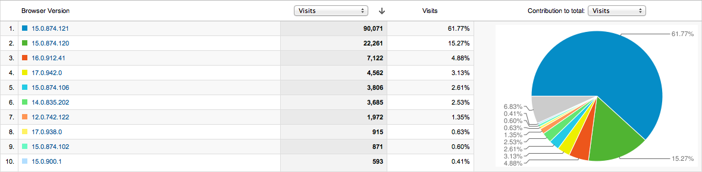
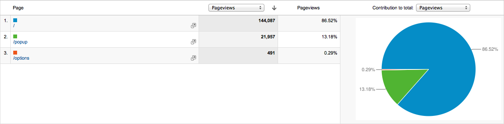
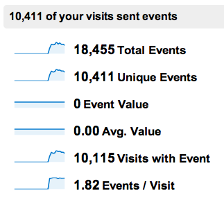
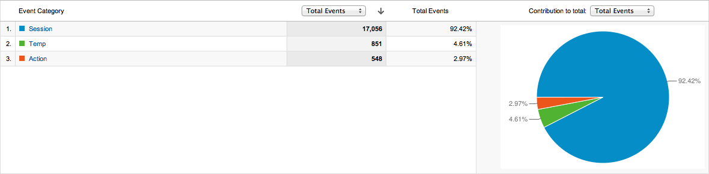
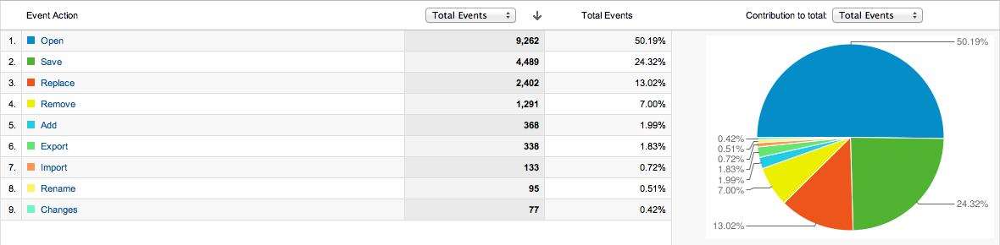
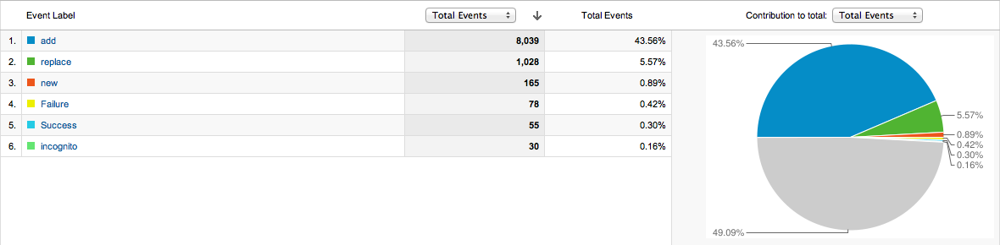

So it's been 10 days since I added Google Analytics tracking to Session Manager. The stats are pretty interesting, so I thought it would be fun to list some of the things I've learned...

First, some base stats. Session Manager has 10.5k users at the moment, according to the Developer Dashboard. I pushed out the update on the early in the morning on the 17th, and within a day most of the extension's users had updated and continued trickling in over the next few days.

*Each "visit" is a browser session, and pageviews are browser sessions + actual extension uses.*

	

### Location
It surprises me how many installs are from non-US users, and especially how non-US cities dominate. Internationalization is definitely on the todo list, as there's probably a huge untapped market that would love it...

	

	

### Technology
Sad but expected, Windows by far outnumbers everything else. As far as Chrome versions go, I was shocked to see 12 so high, but otherwise it's pretty awesome.

	

	

### Behavior
It surprises me how much people use the "replace" feature (overwrite a session with the current tabs). It was the most requested thing until I added it, but still.

It also surprises me how much import/export are used, since they aren't very intuitive, meant to be just a temporarily solution until Chrome gets extension data syncing. I'm guessing though that that's why users rarely import, and as shown in the event labels graphic, it often fails when they do (due to user error).

I'm most surprised, though, by how few people use the rename feature and view the recent changes when it updates. I need to figure out how to display an update notification better, but I'm not sure about the renaming...

	
	

	
	
	

Anyway, I found having access to this much data really cool and just thought I'd share. Interested in Session Manager? [Check it out](https://chrome.google.com/webstore/detail/mghenlmbmjcpehccoangkdpagbcbkdpc)!